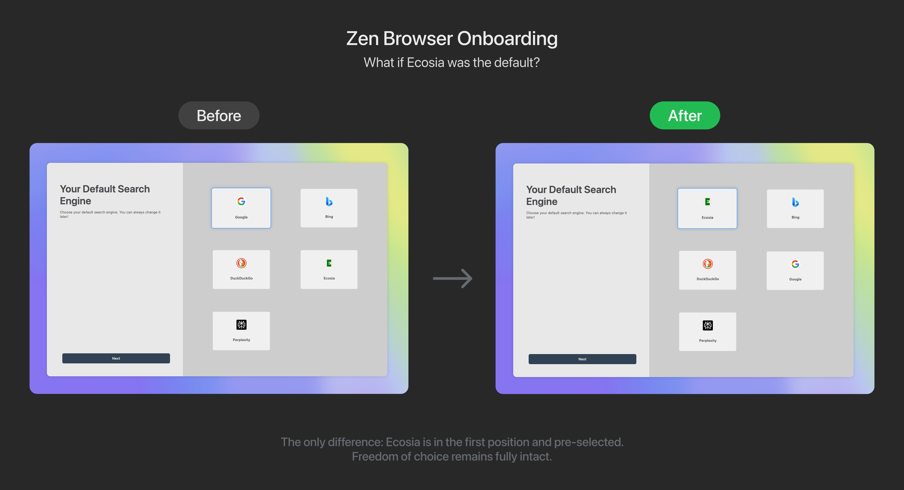

I recently had to change my browser, which probably doesn't sound very exciting to many people. The Arc browser, my previous companion, has not been actively developed since May 2025. The company behind it is now focusing entirely on its new AI browser, Dia. Like many former Arc users who don't yet want to use an AI browser, I switched to Zen Browser, an open source project based on Firefox that has adopted Arc's UI almost 1-to-1. Zen is still a niche product with around 9 million downloads on GitHub, a tiny percentage compared to the billions of Chrome installations. But that's what makes it so interesting as a case study.

What got me thinking during setup was a simple detail. The selection of the default search engine. There it was, the list of available search engines. Google, of course, was preselected. Ecosia, however, was in 4th place (out of 5). And I asked myself why this order?

As someone who works intensively with digital nudging, I realized immediately what was happening here. The default setting is not a coincidence, but a deliberate decision. 

## What makes defaults so powerful and why browsers are special

Defaults are among the most powerful nudges of all. Research shows consistently that most people stick with the default, a behavior known as status quo bias. We choose the path of least resistance. Thaler and Sunstein (2008) have described impressively in Nudge how default options influence our behavior in areas such as retirement planning or organ donation. Johnson and Goldstein (2003) showed that countries with opt-out regulations have significantly higher approval rates for organ donation than countries with opt-in.

The same mechanism applies to the browser setup. The pre-selected search engine is never changed by the large majority of users. Those who set Google as their default search engine know this very well and are also aware of its advantages.

But this is where the real leverage lies, because browsers are universal - practically everyone who uses the internet uses a browser and goes through a setup process at some point. That's not just millions, that's billions of decision moments. A default in a popular browser is not a niche issue, but a lever with global impact.

Ecosia, the search engine from Berlin, has so far planted over 231 million trees in more than 35 countries. The company invests 100% of its profits in climate protection. If Ecosia were as big as Google, it could bind 15% of global CO₂ emissions, according to its own calculations.

In this case, a thought experiment comes to mind. What if browser manufacturers didn't put Ecosia in 4th place, but as the default? From a nudging perspective, this would be an elegant intervention with the same mechanism but a positive social outcome. An example of what Thaler and Sunstein call libertarian paternalism. Freedom of choice is fully preserved, but the architecture favors a socially desirable option. 

## How simple the change would be

Of course, this raises ethical questions. Who decides which defaults are "good"? Does a positive purpose legitimize the influence? Defaults are never neutral. Every pre-selected option implicitly carries a recommendation. The question is not whether we influence people through choice architecture (we inevitably do). The question is how transparent we are about it and which values flow into these architectures.

To show how minimal the intervention would be, I created a before-and-after mockup. 

#### Abbildung 1: Left: Current state with Google as default. Right: Ecosia as default.

The technical effort? Two lines of code to change the order and set the default. The impact? Millions of users planting trees by simply taking the path of least resistance.

This is what's fascinating about nudging. The difference appears subtle. Ecosia would be in first position and pre-selected, plus a small "Recommended" label. Google, DuckDuckGo and Bing would still be just one click away. But the default would make a statement. The small info box that appears when Ecosia is selected gives users a concrete reason to stick with this choice, without being preachy. This is another nudge that increases the salience of positive consequences without manipulating the decision. 

## The lever that browser companies hold

Browser manufacturers may underestimate the influence they have on collective behavior. A browser is not a neutral tool; it's a platform that frames billions of interactions daily. Every default, every order in a list, every pre-selected checkbox is a decision that someone makes for billions of people. If a browser with 100 million users sets a sustainable search engine as the default and the majority sticks with it, a measurable ecological impact emerges without people having to actively change anything.

Browser manufacturers could take a pioneering role here. Not through coercion, but through deliberate design of choice architecture. Users can switch to Google at any time, but the default would make a statement. And that's exactly the core of nudging. Not patronizing people, but designing the decision environment so that the better choice is also the easier one. 

## Referenzen

Thaler, R. H., & Sunstein, C. R. (2008). *Nudge: Improving decisions about health, wealth, and happiness.* Yale University Press.

Johnson, E. J., & Goldstein, D. (2003). Do defaults save lives? *Science, 302*(5649), 1338-1339.

Ecosia (2025). Finanzberichte und Transparenz. https://www.ecosia.org