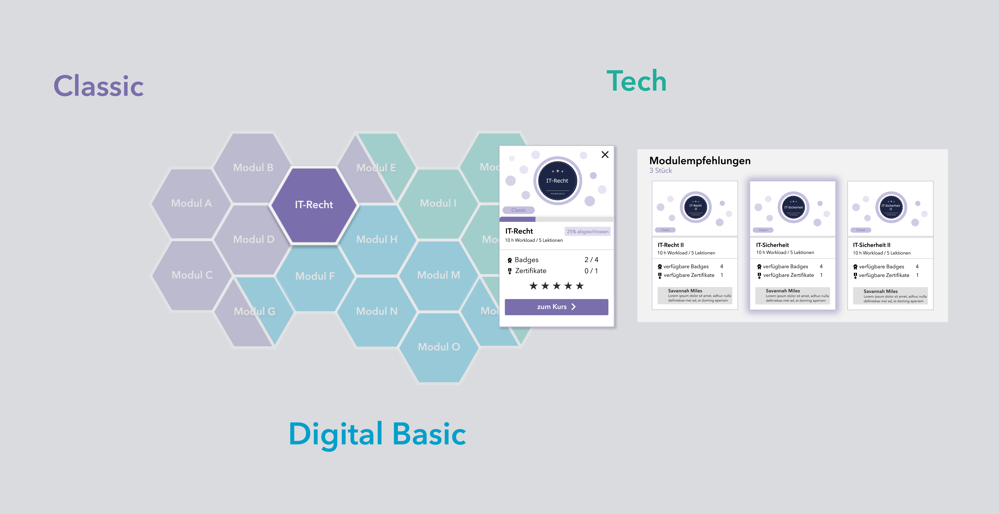

---

##### Download

+ [Paper](paper1.pdf)

---

##### Abstract

Die zukünftige Arbeitswelt wird durch die ständig wachsenden digitalen Informationen und Abläufe verändert. Anerkannte Berufsbilder verändern sich und erhalten neue Anforderungsprofle (vgl. Rettig, 2020). Digitale Technologien und internetbasierte Applikationen werden in fast allen Branchen immer wichtiger, sodass die hierfür nötigen Kompetenzen immer gefragter werden (Kirchherr, Klier, Lehmann-Brauns & Winde, 2018). Das Diskussionspapier des Stifterverbandes zieht daher die Bilanz: „In den kommenden fünf Jahren werden in Deutschland rund 700.000 Personen mehr als heute benötigt, die über technologische Fähigkeiten verfügen“ (Kirchherr et al., 2018). Auch Ehlers (2020) stellt fest, dass „[…] derzeitige Konzepte der Hochschulbildung den drängenden Herausforderungen unserer Gesellschaften keine überzeugenden Zukunftskonzepte entgegenstellen“ und daher auf die erwarteten neuen Entwicklungen abgestimmt werden müssen. In Schleswig-Holstein wird daher aktuell die hochschulübergreifende FutureSkillsPlattform entwickelt (http://futureskills-sh.de/), die digitale Grundkompetenzen vermittelt. In deren Rahmen wurde ein Kompetenzraster entworfen, das einerseits die Lernangebote strukturiert, andererseits den Lernenden Hilfestellungen zur Selbsteinschätzung und bei der Auswahl weiterer Lernangebote bieten soll. [Aus: Einleitung]

---

##### Figure 1: Gesamtansicht des Kompetenzrasters



---

##### Citation

Harder, Thorleif. (2021). Nutzerzentrierte Entwicklung und Evaluation eines visuellen Kompetenzrasters für digitale Lernangebote. Gemeinschaften in Neuen Medien. Digitale Partizipation in hybriden Realitäten und Gemeinschaften., 61–69. https://doi.org/10.25368/2022.27

```BibTeX
@@inproceedings{harder-kompetenzraster_2021,
title = {Nutzerzentrierte Entwicklung und Evaluation eines visuellen Kompetenzrasters für digitale Lernangebote},
author = {Thorleif Harder},
editor = {Thomas Köhler and Eric Schoop and Nina Kahnwald},
url = {https://nbn-resolving.org/urn:nbn:de:bsz:14-qucosa2-783915},
year = {2021},
date = {2021-10-08},
booktitle = {Digitale Partizipation in hybriden Realitäten und Gemeinschaften. Tagungsband der Jahreskonferenz der Gemeinschaften in neuen Medien (GeNeMe) vom 07.–08.10.2021 in Dresden},
publisher = {TUDpress},
address = {Dresden},
keywords = {higher education, massive open online course (MOOC), pMOOCs},
pubstate = {published},
tppubtype = {inproceedings}
}
```

---

##### Related material

<!-- + [XY](XYZ.pdf) -->
<!-- + [XY](LINK) – Lorem ipsum -->
<!-- + [Column title](XYZ.pdf) – Lorem ipsum -->

